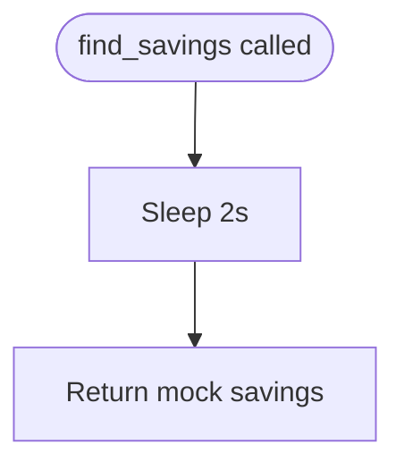

# mock_shopper.py

Mock AI agent simulating insurance quote shopping and savings calculation.

## At-a-Glance Summary

Provides a placeholder `find_savings()` function that mimics AI-driven insurance comparison. Sleeps for 2 seconds to simulate processing, then returns hardcoded savings data. No real AI logic yet—intended for MVP demo.

Depends on: None (pure Python).
Called by: `api_routes/shop.py`.

## Flowchart



## Public Interface

- `find_savings(data: dict) -> dict`: Takes coverage fields, returns savings dict.

## Dependencies

- **Inbound:** `api_routes/shop.py` imports and calls `find_savings`.
- **Outbound:** None.

## Edge Cases

- Always succeeds; no error handling.
- Fixed delay; no async or real computation.

## Examples

```python
result = find_savings({"bodily_injury": "100/300", ...})
# {"savings_6mo": 246.00, "new_carrier": "Rebel Mutual"}
```

## Change Hooks

- Config: None.
- Tests: `tests/agent/test_mock_shopper.py`.
- Env: None.

## Links

- Related: [Shop API](../../../docs/api_routes/shop.md)
