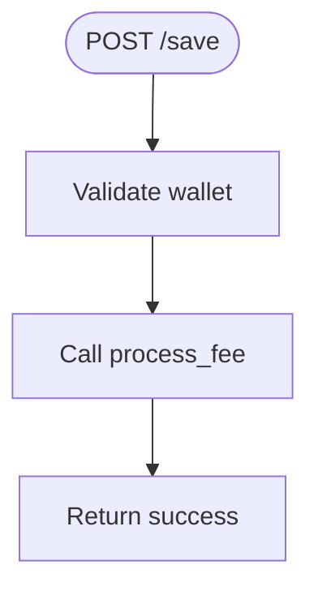

# save.py

FastAPI router for handling fee payment and saving user data.

## At-a-Glance Summary

Defines a POST /save endpoint that takes a wallet address and processes a fee via the Arc service. Currently a thin wrapper around `process_fee()`; returns success status. Placeholder for full payment logic.

Depends on: `services.arc_service`.
Called by: Frontend `checkout.js`.

## Flowchart



## Public Interface

- `router: APIRouter` - FastAPI router with /save endpoint.

## Dependencies

- **Inbound:** Mounted in `backend/main.py`.
- **Outbound:** `services.arc_service.process_fee`.

## Edge Cases

- Exceptions bubble up as 500 errors.
- No validation on wallet format.

## Examples

```python
# Via HTTP POST
{"wallet_address": "0x123..."} → {"status": "success"}
```

## Change Hooks

- Config: CONTRACT_ADDRESS in arc_service.
- Tests: Integration tests needed.
- Env: None.

## Links

- Related: [Arc Service](../../../docs/services/arc_service.md), [Checkout](../../../docs/frontend/checkout.js.md)
