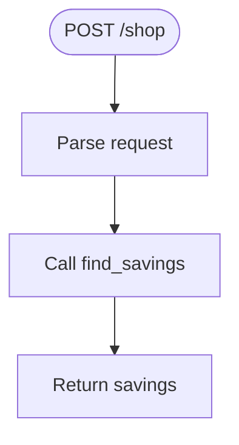

# shop.py

FastAPI router for insurance shopping and savings calculation.

## At-a-Glance Summary

POST /shop endpoint accepting insurance coverage fields, calls the mock shopper agent to find savings. Returns savings data. Placeholder for real quote comparison.

Depends on: `agent.mock_shopper`.
Called by: Frontend `scan.js`.

## Flowchart



## Public Interface

- `router: APIRouter` - Router with /shop endpoint.

## Dependencies

- **Inbound:** Frontend fetch.
- **Outbound:** `agent.mock_shopper.find_savings`.

## Edge Cases

- Catches all exceptions as 500.
- No input validation.

## Examples

```python
# POST /shop
{"bodily_injury": "100/300", ...} → {"savings_6mo": 246.00, "new_carrier": "Rebel Mutual"}
```

## Change Hooks

- Config: None.
- Tests: Integration tests.
- Env: None.

## Links

- Related: [Mock Shopper](../../../docs/agent/mock_shopper.md), [Scan Page](../../../docs/frontend/scan.js.md)
