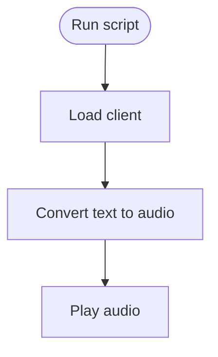

# elevenlabsVoice.py

Script for testing ElevenLabs voice synthesis.

## At-a-Glance Summary

Loads ElevenLabs client, converts hardcoded text to speech, and plays it. Demo script for voice features; not integrated into main app yet.

Depends on: elevenlabs library, dotenv.
Called by: Manual run.

## Flowchart



## Public Interface

- None (script).

## Dependencies

- **Inbound:** None.
- **Outbound:** ElevenLabs API.

## Edge Cases

- Requires ELEVENLABS env var.
- Plays immediately; no error handling.

## Examples

```bash
python elevenlabsVoice.py
# Plays "The first move is what sets everything in motion."
```

## Change Hooks

- Config: .env with ELEVENLABS key.
- Tests: None.
- Env: ELEVENLABS_API_KEY.

## Links

- Related: [Main App](../../../docs/backend/main.md)
