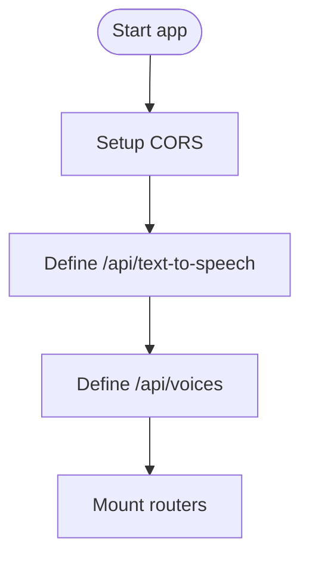

# main.py

Main FastAPI application for NsureCat backend.

## At-a-Glance Summary

Sets up FastAPI app with CORS, ElevenLabs integration for text-to-speech and voices endpoints. Serves as API server; routes mounted from api_routes.

Depends on: fastapi, httpx, pydantic.
Called by: Uvicorn or direct run.

## Flowchart



## Public Interface

- `app: FastAPI` - The main app instance.
- Endpoints: POST /api/text-to-speech, GET /api/voices.

## Dependencies

- **Inbound:** Frontend fetches.
- **Outbound:** ElevenLabs API, mounted routers.

## Edge Cases

- Timeouts and API errors handled with HTTPExceptions.
- No auth; public endpoints.

## Examples

```python
uvicorn main:app --host 0.0.0.0 --port 8000
# Then POST /api/text-to-speech with text and voice_id
```

## Change Hooks

- Config: ELEVENLABS_API_KEY env.
- Tests: `tests/backend/test_main.py`.
- Env: ELEVENLABS_API_KEY.

## Links

- Related: [API Routes](../../../docs/api_routes/README.md), [ElevenLabs Voice](../../../docs/backend/elevenlabsVoice.md)
