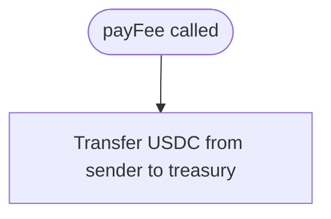

# NsureCatFee.sol

Solidity contract for collecting insurance shopping fees in USDC.

## At-a-Glance Summary

Simple contract allowing users to pay a fixed 0.01 USDC fee to the treasury. Uses transferFrom for payment; deployed on Arc Testnet.

Depends on: IERC20 interface.
Called by: `services/arc_service.py` via Web3.

## Flowchart



## Public Interface

- `payFee()`: External function to pay fee.

## Dependencies

- **Inbound:** Web3 calls from backend.
- **Outbound:** USDC contract.

## Edge Cases

- Assumes sender has approved contract for transfer.
- Fixed fee; no dynamic pricing.

## Examples

```solidity
contract.payFee(); // Transfers 0.01 USDC
```

## Change Hooks

- Config: Treasury and USDC addresses in constructor.
- Tests: Deploy on testnet.
- Env: Arc Testnet.

## Links

- Related: [Arc Service](../../../docs/services/arc_service.md)
