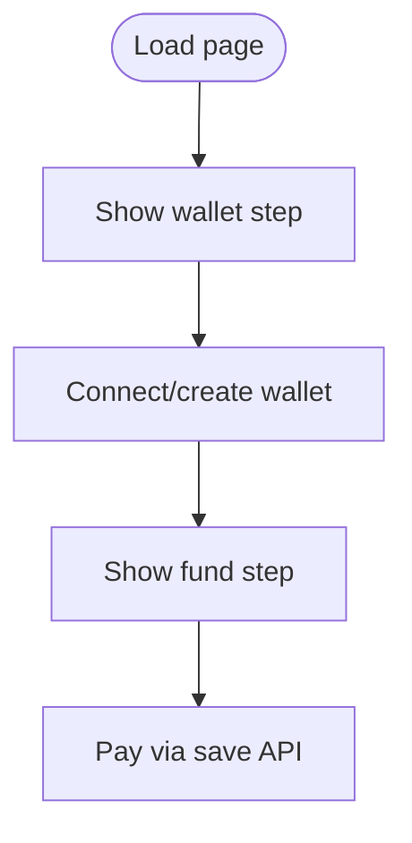

# checkout.html

HTML page for wallet connection and payment checkout.

## At-a-Glance Summary

Two-step checkout: connect/create wallet, then fund and pay 10% fee. Uses Circle Wallets SDK placeholder. Static page served by http.server.

Depends on: styles.css, checkout.js.
Called by: results.js button.

## Flowchart

## Public Interface

- HTML form with buttons.

## Dependencies

- **Inbound:** Navigation from results.html.
- **Outbound:** checkout.js, save API.

## Edge Cases

- Wallet creation not implemented.
- Requires MetaMask for connect.

## Examples

- User clicks "Connect Existing Wallet" → MetaMask popup.

## Change Hooks

- Config: Circle SDK script.
- Tests: Manual browser test.
- Env: None.

## Links

- Related: [Checkout JS](../../../docs/frontend/checkout.js.md), [Save API](../../../docs/api_routes/save.md)
