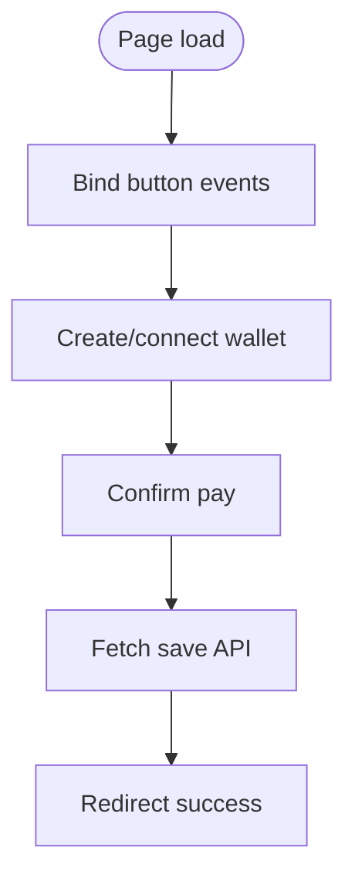

# checkout.js

JavaScript for handling checkout wallet and payment logic.

## At-a-Glance Summary

Manages wallet creation/connection (placeholders) and payment confirmation via POST to /v1/save. Redirects to success on completion.

Depends on: None (vanilla JS).
Called by: checkout.html.

## Flowchart



## Public Interface

- Event listeners on buttons.

## Dependencies

- **Inbound:** checkout.html.
- **Outbound:** MetaMask, save API.

## Edge Cases

- Alerts on errors; no wallet validation.
- Create wallet not implemented.

## Examples

```javascript
// On connectWallet click
await window.ethereum.request({ method: 'eth_requestAccounts' });
```

## Change Hooks

- Config: None.
- Tests: None.
- Env: None.

## Links

- Related: [Checkout HTML](../../../docs/frontend/checkout.html.md), [Save API](../../../docs/api_routes/save.md)
