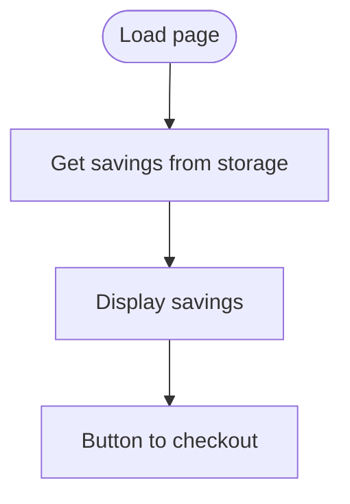

# results.html

HTML page displaying potential insurance savings.

## At-a-Glance Summary

Shows savings from localStorage, with button to proceed to checkout. Simple static page.

Depends on: styles.css, results.js.
Called by: scan.js redirect.

## Flowchart

## Public Interface

- HTML with div for display.

## Dependencies

- **Inbound:** Navigation from scan.html.
- **Outbound:** results.js.

## Edge Cases

- Assumes savings in localStorage.
- No error if missing.

## Examples

- Displays: "You Save: $246.00 for 6 months! New Carrier: Rebel Mutual"

## Change Hooks

- Config: None.
- Tests: Manual.
- Env: None.

## Links

- Related: [Results JS](../../../docs/frontend/results.js.md), [Scan Page](../../../docs/frontend/scan.js.md)
