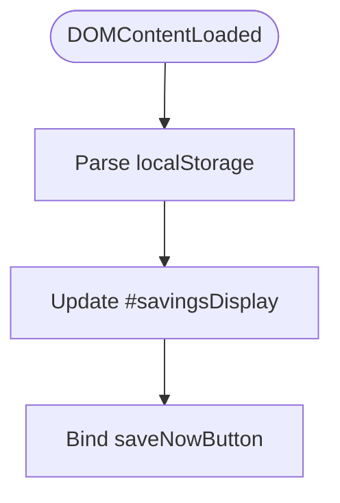

# results.js

JavaScript for loading and displaying savings results.

## At-a-Glance Summary

On load, parses savings from localStorage and injects into DOM. Button redirects to checkout.

Depends on: None.
Called by: results.html.

## Flowchart



## Public Interface

- DOM manipulation.

## Dependencies

- **Inbound:** results.html.
- **Outbound:** None.

## Edge Cases

- No savings → empty display.
- Assumes JSON format.

## Examples

```javascript
const savings = JSON.parse(localStorage.getItem('savings'));
// Inject HTML
```

## Change Hooks

- Config: None.
- Tests: None.
- Env: None.

## Links

- Related: [Results HTML](../../../docs/frontend/results.html.md), [Checkout](../../../docs/frontend/checkout.html.md)
