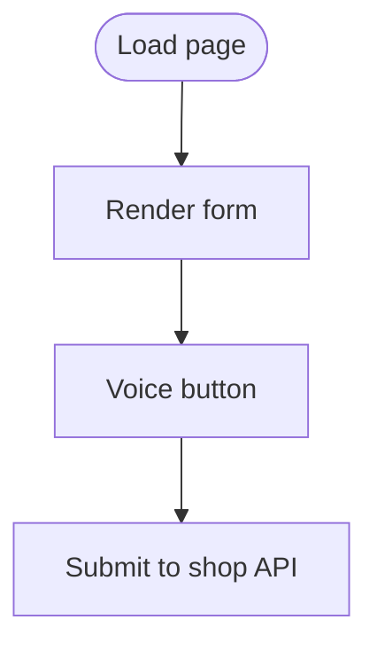

# scan.html

HTML form for inputting insurance policy details.

## At-a-Glance Summary

Form with fields for bodily injury, etc., plus voice input button. Submits to shop API.

Depends on: styles.css, scan.js.
Called by: User navigation.

## Flowchart

## Public Interface

- HTML form.

## Dependencies

- **Inbound:** Initial page.
- **Outbound:** scan.js, shop API.

## Edge Cases

- Required fields; no client validation.

## Examples

- User fills form, clicks "Find My Savings" → POST to /v1/shop.

## Change Hooks

- Config: None.
- Tests: Manual.
- Env: None.

## Links

- Related: [Scan JS](../../../docs/frontend/scan.js.md), [Shop API](../../../docs/api_routes/shop.md)
