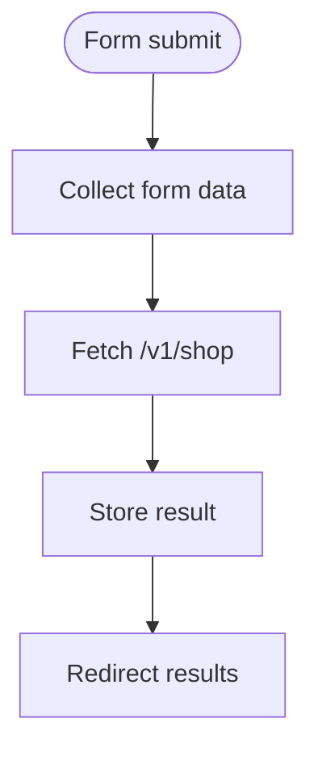

# scan.js

JavaScript for handling policy scan form and voice input.

## At-a-Glance Summary

Submits form data to /v1/shop, stores result in localStorage, redirects to results. Voice button uses Web Speech API placeholder.

Depends on: None.
Called by: scan.html.

## Flowchart



## Public Interface

- Event listeners.

## Dependencies

- **Inbound:** scan.html.
- **Outbound:** Shop API.

## Edge Cases

- Alerts on fetch error.
- Voice parsing placeholder.

## Examples

```javascript
const response = await fetch('http://localhost:8000/v1/shop', { method: 'POST', body: JSON.stringify(data) });
```

## Change Hooks

- Config: localhost URLs.
- Tests: None.
- Env: None.

## Links

- Related: [Scan HTML](../../../docs/frontend/scan.html.md), [Shop API](../../../docs/api_routes/shop.md)
