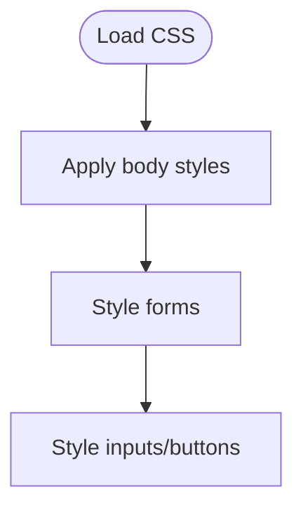

# styles.css

Global CSS styles for the frontend.

## At-a-Glance Summary

Basic styling for body, forms, inputs, buttons. Centered layout, simple fonts.

Depends on: None.
Called by: All HTML files.

## Flowchart



## Public Interface

- CSS rules.

## Dependencies

- **Inbound:** HTML link tags.
- **Outbound:** None.

## Edge Cases

- Fixed max-width; not responsive beyond basic.

## Examples

```css
body { font-family: Arial; max-width: 800px; margin: 0 auto; padding: 20px; }
```

## Change Hooks

- Config: None.
- Tests: Visual inspection.
- Env: None.

## Links

- Related: All frontend HTML files.
