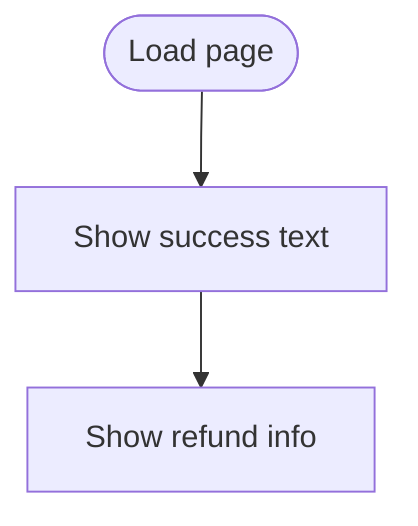

# success.html

HTML page confirming payment success.

## At-a-Glance Summary

Displays success message and v2 refund hook mockup. Static page after payment.

Depends on: styles.css.
Called by: checkout.js redirect.

## Flowchart

## Public Interface

- HTML content.

## Dependencies

- **Inbound:** Navigation from checkout.
- **Outbound:** None.

## Edge Cases

- No dynamic content.

## Examples

- "Your payment has been processed. ... credit."

## Change Hooks

- Config: None.
- Tests: Manual.
- Env: None.

## Links

- Related: [Checkout JS](../../../docs/frontend/checkout.js.md)
