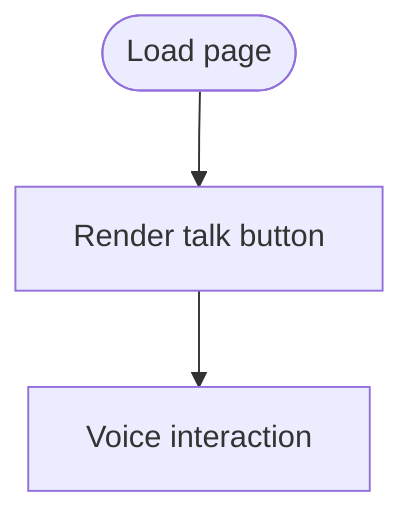

# voice.html

HTML page for AI voice assistant interface.

## At-a-Glance Summary

Styled page with talk button for voice interaction. Placeholder for ElevenLabs integration.

Depends on: Inline styles.
Called by: Possibly scan.js.

## Flowchart

## Public Interface

- HTML with button.

## Dependencies

- **Inbound:** User access.
- **Outbound:** JS for voice (not shown).

## Edge Cases

- Gradient background; overflow hidden.

## Examples

- Click button to start voice.

## Change Hooks

- Config: None.
- Tests: Manual.
- Env: None.

## Links

- Related: [Scan JS](../../../docs/frontend/scan.js.md)
