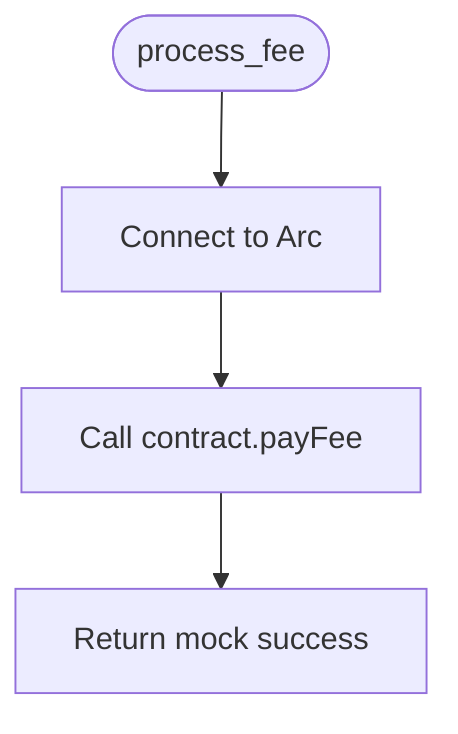

# arc_service.py

Service for processing fees on Arc blockchain.

## At-a-Glance Summary

Uses Web3 to connect to Arc Testnet and call payFee on the contract. Placeholder with mock success.

Depends on: web3.
Called by: api_routes/save.py.

## Flowchart



## Public Interface

- `process_fee(user_wallet: str) -> dict`: Processes payment.

## Dependencies

- **Inbound:** save.py.
- **Outbound:** Arc RPC, contract.

## Edge Cases

- Placeholder addresses; no real tx.
- Raises on connection fail.

## Examples

```python
result = process_fee("0x123...")
# {"status": "success", "tx_hash": "0x..."}
```

## Change Hooks

- Config: CONTRACT_ADDRESS, etc.
- Tests: Mock Web3.
- Env: None.

## Links

- Related: [Save API](../../../docs/api_routes/save.md), [Contract](../../../docs/contracts/NsureCatFee.md)
