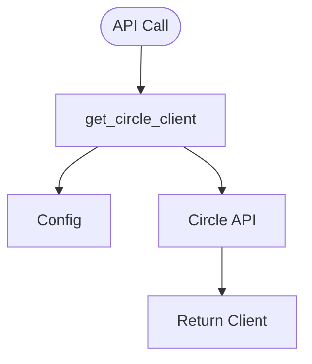

# client.py — Circle API Client

**At-a-Glance Summary:**
- Initializes and returns a Circle Developer-Controlled Wallet client for API calls.
- Uses configuration from `config.py` for API keys and secrets.
- Centralizes Circle API client creation for wallet, transfer, and transaction modules.



## Public Interface
- `get_circle_client()` — Returns a Circle API client instance.

## Dependencies
- Inbound: All backend wallet modules
- Outbound: Circle API, `config.py`

## Edge Cases
- Requires valid API key and entity secret in environment/config.

## Example Usage
```python
client = get_circle_client()
```

## Change Hooks
- Config: `config.py` (API keys)
- Tests: To be added in `tests/backend/app/`

## Links
- [Circle API Docs](https://developers.circle.com/docs/developer-controlled-wallets)
- [config.py](./config.md)
