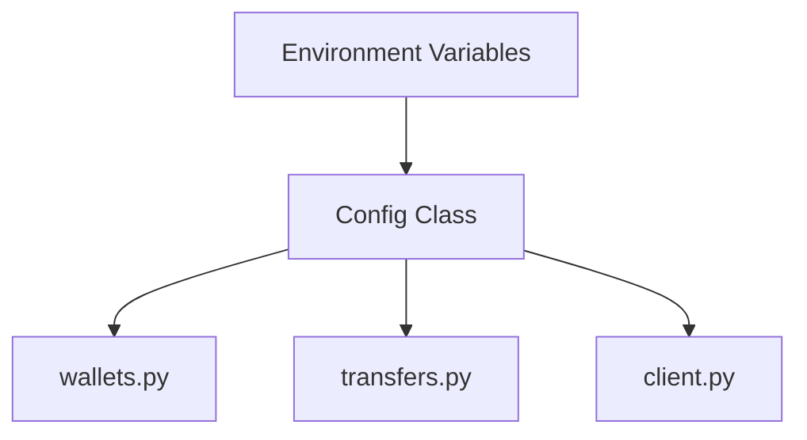

# config.py — Configuration for Circle Wallets

**At-a-Glance Summary:**
- Loads API keys and secrets from environment variables using dotenv.
- Centralizes configuration for Circle developer-controlled wallet modules.
- Used by all wallet, transfer, and transaction modules.



## Public Interface
- `Config.TEST_API_KEY` — API key for Circle
- `Config.ENTITY_SECRET` — Entity secret for Circle
- `Config.WALLET_SET_ID` — Wallet set ID

## Dependencies
- Inbound: All backend wallet modules
- Outbound: `.env` file, OS environment

## Edge Cases
- Requires valid environment variables to be set.

## Example Usage
```python
api_key = Config.TEST_API_KEY
```

## Change Hooks
- `.env` file changes
- Tests: To be added in `tests/backend/app/`

## Links
- [client.py](./client.md)
- [wallets.py](./wallets.md)
