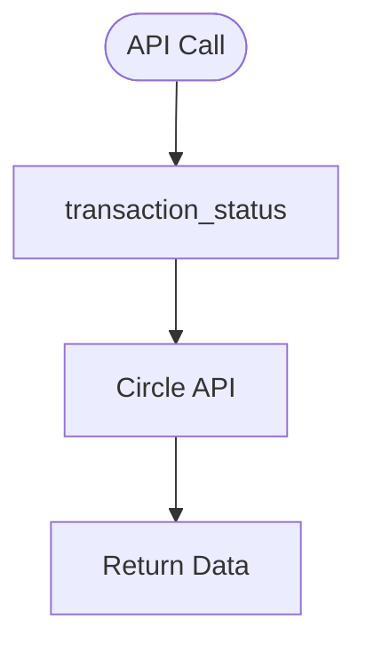

# getTransactionState.py — Transaction Status API

**At-a-Glance Summary:**
- Provides function to fetch transaction status from Circle's developer-controlled wallet API.
- Used to check the state of token transfers and other wallet transactions.



## Public Interface
- `transaction_status(transaction_id)` — Fetches status for a transaction.

## Dependencies
- Inbound: Backend API calls
- Outbound: Circle API, `client.py`

## Edge Cases
- Handles Circle API exceptions and prints errors.
- Requires valid transaction ID.

## Example Usage
```python
transaction_status(tx_id)
```

## Change Hooks
- Config: `config.py` (API keys)
- Tests: To be added in `tests/backend/app/`

## Links
- [Circle API Docs](https://developers.circle.com/docs/developer-controlled-wallets)
- [client.py](./client.md)
