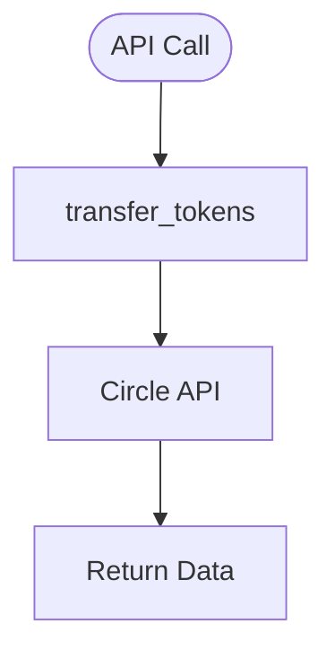

# transfers.py — Token Transfer API

**At-a-Glance Summary:**
- Provides function to transfer tokens between wallets using Circle's developer-controlled wallet API.
- Used for moving funds between user and system wallets.



## Public Interface
- `transfer_tokens(source_wallet_id, destination_wallet_id, amount, token_address)` — Transfers tokens between wallets.

## Dependencies
- Inbound: Backend API calls
- Outbound: Circle API, `client.py`

## Edge Cases
- Handles Circle API exceptions and prints errors.
- Requires valid wallet IDs and token address.

## Example Usage
```python
transfer_tokens(src_id, dest_id, "10.0", token_addr)
```

## Change Hooks
- Config: `config.py` (API keys)
- Tests: To be added in `tests/backend/app/`

## Links
- [Circle API Docs](https://developers.circle.com/docs/developer-controlled-wallets)
- [client.py](./client.md)
