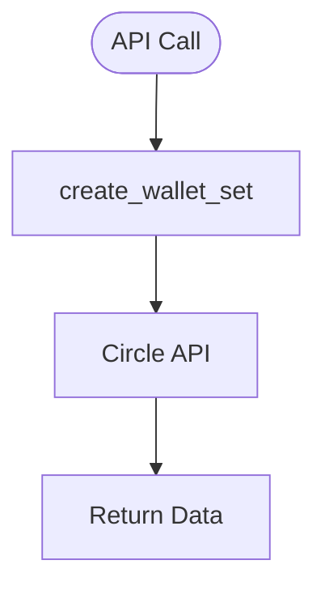

# wallet_sets.py — Wallet Set Management

**At-a-Glance Summary:**
- Provides function to create wallet sets using Circle's developer-controlled wallet API.
- Used to group wallets for developer control and management.



## Public Interface
- `create_wallet_set(name)` — Creates a new wallet set with the given name.

## Dependencies
- Inbound: Backend API calls
- Outbound: Circle API, `client.py`

## Edge Cases
- Handles Circle API exceptions and returns error dicts.
- Requires valid API credentials.

## Example Usage
```python
resp = create_wallet_set("MyWalletSet")
```

## Change Hooks
- Config: `config.py` (API keys)
- Tests: To be added in `tests/backend/app/`

## Links
- [Circle API Docs](https://developers.circle.com/docs/developer-controlled-wallets)
- [client.py](./client.md)
