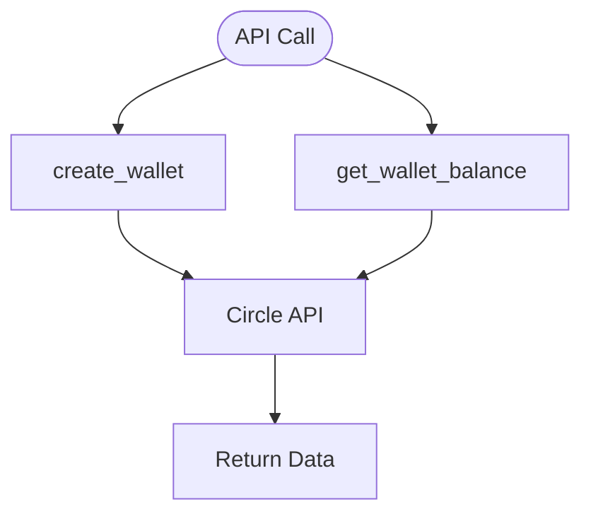

# wallets.py — Developer-Controlled Wallet API

**At-a-Glance Summary:**
- Provides functions to create wallets and fetch wallet balances using Circle's developer-controlled wallet API.
- Relies on configuration from `config.py` and Circle API client from `client.py`.
- Used by backend services to manage user wallets.



## Public Interface
- `create_wallet()` — Creates a new wallet.
- `get_wallet_balance(wallet_id)` — Fetches balance for a wallet.

## Dependencies
- Inbound: Backend API calls
- Outbound: Circle API, `client.py`, `config.py`

## Edge Cases
- Handles Circle API exceptions and returns error dicts.
- Requires valid configuration and wallet set ID.

## Example Usage
```python
resp = create_wallet()
balance = get_wallet_balance(wallet_id)
```

## Change Hooks
- Config: `config.py` (API keys, wallet set ID)
- Tests: To be added in `tests/backend/app/`

## Links
- [Circle API Docs](https://developers.circle.com/docs/developer-controlled-wallets)
- [client.py](./client.md)
- [config.py](./config.md)
