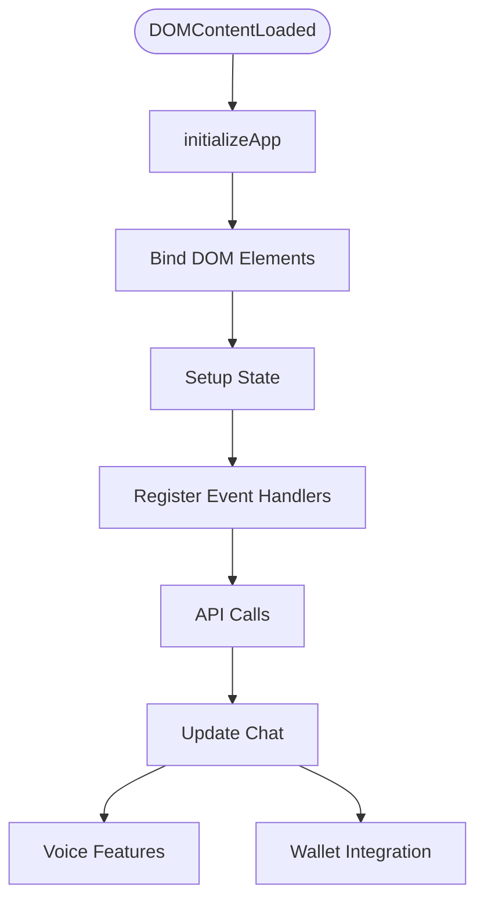

# chat.js — Frontend Chat Logic

At-a-Glance Summary:
- Implements the main chat interface for NsureCat using vanilla JavaScript.
- Handles user input, chat history, voice features, wallet integration, and API calls.
- Called by `index.html` and interacts with backend via REST API.
- Depends on global config and DOM elements.
- Entry point: `DOMContentLoaded` event triggers `initializeApp()`.



## Public Interface
- `initializeApp()` — Sets up the chat app and event listeners.
- `appState` — Global state object for chat, user, wallet, etc.
- DOM event handlers for send, voice, theme, etc.

## Dependencies
- Inbound: `index.html` (script include)
- Outbound: Backend API, wallet provider, voice API

## Edge Cases
- Handles missing config gracefully.
- Prevents double submission while processing.
- Handles voice recognition errors.
- Validates user input before sending.

## Example Usage
```html
<script src="chat.js"></script>
```

## Change Hooks
- Config: `config.js` (optional)
- Tests: See `tests/frontend/test_chat_flow.py`

## Links
- [Frontend README](../../../../src/frontend/README.md)
- [Backend API Docs](../../../../docs/src/backend/main.md)
