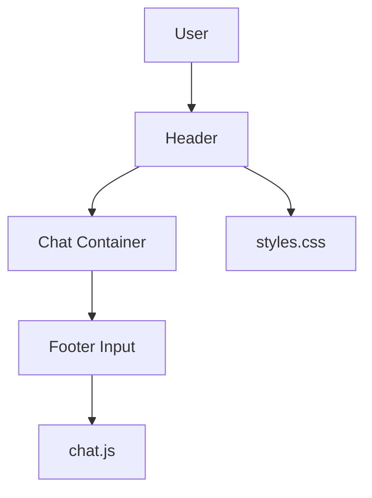

# index.html — Main Chat UI

At-a-Glance Summary:
- Main HTML entry point for NsureCat chat application.
- Loads `chat.js` and `styles.css`.
- Provides UI for chat, voice, wallet, and theme toggle.
- Entry point for user interaction.

## Public Interface
- HTML elements: `chat-messages`, `user-input`, `send-btn`, `voice-btn`, `theme-toggle`, etc.
- Loads scripts and styles.

## Dependencies
- Inbound: Browser, Python http.server
- Outbound: `chat.js`, `styles.css`, backend API

## Edge Cases
- Responsive design for mobile/desktop.
- Accessibility: ARIA roles and labels.

## Example Usage
Open in browser after starting frontend server.

## Change Hooks
- Config: `config.js` (optional)
- Tests: See `tests/frontend/test_chat_flow.py`

## Links
- [Frontend README](../../../../src/frontend/README.md)
- [Chat Logic](./chat.js.md)
