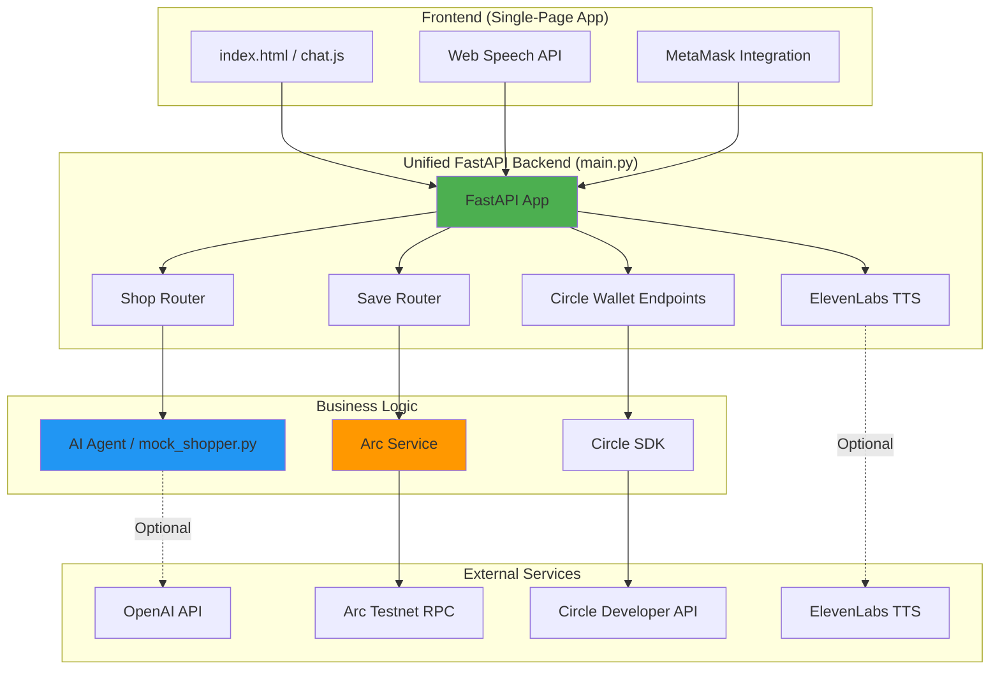
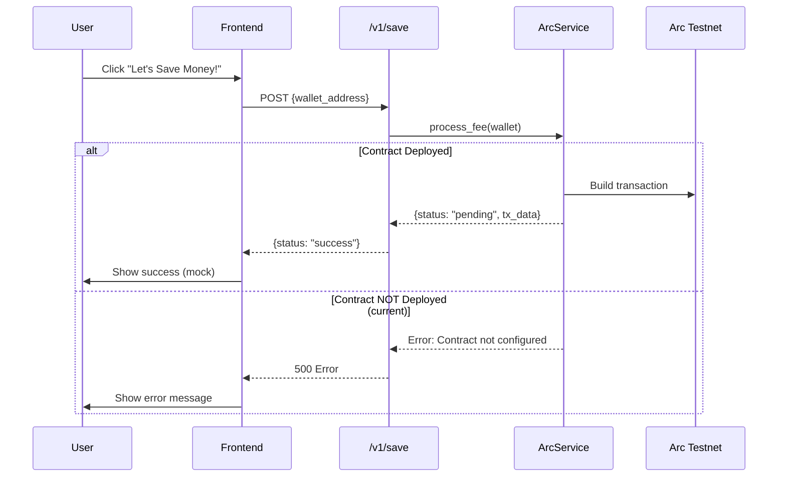

# NsureCat Architecture Update

**Date**: 2025-11-05
**Version**: Post-Integration (v0.0.0.4)
**Status**: ✅ Backend Unified, Ready for Demo

---

## 🎯 Overview

This document reflects the current state of NsureCat after major backend integration work. The system now has a unified FastAPI backend that serves both the insurance shopping features and Circle wallet operations.

---

## 📊 System Architecture



---

## 🔧 Backend Architecture (Unified)

### File: `src/backend/main.py`

**Current State**: Fully integrated FastAPI application combining all endpoints.

#### Endpoints:

**Core API**:
- `GET /` - Health check, returns `{"message": "NsureCat MVP API"}`

**Insurance Shopping (Shop Router)**:
- `POST /v1/shop` - Get insurance quote
  - Input: Policy coverage details (6 fields)
  - Calls: `agent.mock_shopper.find_savings()`
  - Returns: `{savings_6mo, new_carrier}`

**Payment Processing (Save Router)**:
- `POST /v1/save` - Process USDC fee payment
  - Input: `{wallet_address}`
  - Calls: `services.arc_service.process_fee()`
  - Returns: `{status: "success"}` or transaction data

**Circle Wallet Operations**:
- `POST /wallet-sets/create` - Create wallet set
- `POST /wallets/create` - Create new Circle wallet
- `GET /wallets/balance/{wallet_id}` - Get wallet balance
- `POST /transfers` - Transfer USDC tokens
- `GET /transactions/{transaction_id}` - Check transaction status

**Voice AI (ElevenLabs)** ✅ Enabled:
- `POST /api/text-to-speech` - Convert text to speech
  - Input: `{text, voice_id?}`
  - Returns: Audio stream (audio/mpeg)
  - Graceful degradation if API key not set
- `GET /api/voices` - List available voices

#### Configuration:

**CORS**: Enabled for all origins (development mode)

**Dependencies**:
- FastAPI, Uvicorn
- Circle SDK
- OpenAI (optional)
- ElevenLabs (optional)
- Web3.py
- httpx

---

## 🤖 AI Agent Enhancement

### File: `src/agent/mock_shopper.py`

**Major Update**: Now supports both OpenAI and smart mock logic.

#### Behavior:

1. **With OPENAI_API_KEY set**:
   - Uses GPT-3.5-turbo to generate realistic quotes
   - Analyzes coverage details
   - Returns dynamic savings and carrier recommendations

2. **Without API key (default)**:
   - Uses enhanced mock logic
   - Calculates savings based on coverage amounts
   - Varies results (150-400 6-month savings)
   - Random carrier selection from 9 realistic names
   - Includes ±10% randomness for realism

#### Improvements:
- ✅ No longer returns hardcoded $246 / "Rebel Mutual"
- ✅ Coverage-aware calculations
- ✅ Graceful fallback
- ✅ Backward compatible
- ✅ Comprehensive test coverage (5 tests)

---

## 💰 Payment Flow

### Current Implementation:



### Status:
- ⚠️ Smart contract NOT deployed yet
- ⚠️ `arc_service.py` has placeholder addresses
- ✅ Logic complete, waiting for deployment
- 📋 See: `docs/backend/arc-testnet-deployment-requirements.md`

---

## 🎨 Frontend Architecture

### File: `src/frontend/index.html` + `chat.js`

**Status**: Complete and tested (94.4% pass rate)

#### Features:
- ✅ Single-page conversational UI
- ✅ Voice input (Web Speech API)
- ✅ Policy form modal (8 fields)
- ✅ Wallet connection modal (MetaMask + Circle)
- ✅ Theme toggle (light/dark)
- ✅ LocalStorage persistence
- ✅ Responsive design (mobile-first)
- ✅ Loading states and error handling
- ✅ Quick reply buttons

#### API Integration:
- Calls `/v1/shop` for quotes
- Calls `/v1/save` for payment
- Optional: `/api/text-to-speech` for TTS

#### Legacy Pages:
- 🗂️ Archived to `src/frontend/_legacy_archived/`
- Old multi-page flow deprecated
- Includes: scan, results, checkout, success, voice pages

---

## 🧪 Test Coverage

### Backend Tests:

**✅ Implemented**:
- `tests/backend/test_main.py` - Root endpoint test
- `tests/backend/app/test_wallets.py` - Circle wallet tests (16 tests)
- `tests/agent/test_mock_shopper.py` - AI agent tests (5 tests)
- `tests/api_routes/test_shop.py` - Shop endpoint tests (6 tests)
- `tests/api_routes/test_save.py` - Save endpoint tests (9 tests)
- `tests/services/test_arc_service.py` - Arc service tests (8 tests)

**Total Backend Tests**: 45+ tests

### Frontend Tests:

**File**: `tests/frontend/test_chat_flow.py`

- ✅ 17/18 passing (94.4%)
- ❌ 1 integration test requires running backend

**Coverage**:
- Page loads, UI interactions
- Theme toggle, voice button
- Form validation
- LocalStorage
- Wallet modal
- Error handling
- Responsive design
- Accessibility

---

## 📦 Deployment Readiness

### ✅ Ready for Demo:
- [x] Backend unified and running
- [x] Frontend complete and tested
- [x] AI agent enhanced
- [x] Voice TTS enabled
- [x] Circle wallets working
- [x] Environment configuration documented

### ⚠️ Pending for Production:
- [ ] Smart contract deployment (Arc Testnet)
- [ ] Real USDC payment flow
- [ ] OpenAI API key (for enhanced quotes)
- [ ] ElevenLabs API key (for voice)
- [ ] End-to-end integration test

### 📋 Deployment Checklist:

1. **Environment Setup**:
   - Copy `.env.example` to `.env`
   - Fill in Circle API credentials
   - (Optional) Add OpenAI API key
   - (Optional) Add ElevenLabs API key

2. **Smart Contract** (See deployment guide):
   - Deploy `NsureCatFee.sol` to Arc Testnet
   - Update `.env` with contract addresses
   - Test USDC transfer

3. **Run Application**:
   ```bash
   # Backend
   cd src/backend
   python main.py  # Runs on :8000

   # Frontend
   cd src/frontend
   python -m http.server 8001  # Runs on :8001
   ```

4. **Verify**:
   - Open http://localhost:8001
   - Complete chat flow
   - Get insurance quote
   - Test payment (if contract deployed)

---

## 🔄 Data Flow

### User Journey:

1. **Landing** → Chat interface loads
2. **Conversation** → Cat AI greets user
3. **Policy Input** → User fills coverage form
4. **Shopping** → AI agent finds savings
5. **Quote Display** → Shows potential savings
6. **Decision** → User chooses to save or decline
7. **Payment** (if yes) → 0.01 USDC fee via smart contract
8. **Confirmation** → Success message

### API Call Sequence:

```
Frontend                 Backend
   |                        |
   |--POST /v1/shop-------->|
   |   (coverage data)      |
   |                        |---> agent.find_savings()
   |                        |     (OpenAI or mock)
   |                        |
   |<----{savings_6mo}------|
   |                        |
   |--POST /v1/save-------->|
   |   (wallet_address)     |
   |                        |---> arc_service.process_fee()
   |                        |     (Web3 transaction)
   |                        |
   |<----{status}-----------|
```

---

## 🛠️ Tech Stack Summary

### Frontend:
- HTML5, CSS3, Vanilla JavaScript
- Web Speech API (voice input)
- ethers.js (MetaMask)
- LocalStorage (persistence)

### Backend:
- Python 3.10+
- FastAPI + Uvicorn
- Circle SDK
- Web3.py (Arc Testnet)
- OpenAI API (optional)
- ElevenLabs SDK (optional)

### Blockchain:
- Arc Testnet (Arbitrum-based)
- Solidity 0.8.0
- USDC (ERC20)

### Testing:
- Pytest (backend)
- Playwright (frontend E2E)

---

## 📝 Recent Changes (2025-11-05)

### Completed Integration Work:

1. ✅ **Merged main.py versions**
   - Combined Circle wallet + shop/save routers
   - All endpoints now in single FastAPI app
   - CORS configured, proper error handling

2. ✅ **Enabled ElevenLabs TTS**
   - Uncommented voice endpoints
   - Added graceful degradation
   - Helpful error messages if API key missing

3. ✅ **Enhanced AI Agent**
   - Added OpenAI integration (optional)
   - Improved mock logic (coverage-aware)
   - Realistic variable responses

4. ✅ **Comprehensive Testing**
   - 45+ backend tests across all modules
   - Shop/save endpoint tests
   - Arc service tests with mocked Web3
   - Agent tests for both OpenAI and mock modes

5. ✅ **Environment Configuration**
   - Created `.env.example` with all variables
   - Documented all API keys and addresses
   - Clear setup instructions

6. ✅ **Legacy Cleanup**
   - Archived old multi-page frontend
   - Removed confusion, kept reference
   - Added archive README

7. ✅ **Documentation**
   - Arc Testnet deployment guide
   - Architecture update (this doc)
   - Test documentation

---

## 🎯 Next Steps

### For Hackathon Demo:

1. **Deploy Smart Contract** (3-4 hours)
   - Follow `docs/backend/arc-testnet-deployment-requirements.md`
   - Update `.env` with real addresses
   - Test payment flow

2. **Get API Keys** (Optional, 30 mins)
   - OpenAI for enhanced quotes
   - ElevenLabs for voice

3. **Run Integration Tests** (1 hour)
   - Test full user flow
   - Verify all endpoints
   - Check error handling

4. **Create Demo Script** (1 hour)
   - Prepare talking points
   - Note known limitations
   - Plan live demo flow

### For Production (Future):

- Security audit smart contract
- Add rate limiting
- Implement user authentication
- Real insurance carrier integrations
- Monitoring and logging
- Multi-chain support
- Enhanced AI with real quote APIs

---

## 📞 Support & References

- **Main README**: `/README.md`
- **Run Guide**: `/run.md`
- **Arc Deployment**: `/docs/backend/arc-testnet-deployment-requirements.md`
- **Environment Setup**: `/.env.example`
- **Frontend README**: `/src/frontend/README.md`
- **Integration Specs**: `/docs/tech/integration specs.md`

---

**Document Version**: 1.0
**Last Updated**: 2025-11-05
**Status**: ✅ Current and Accurate
