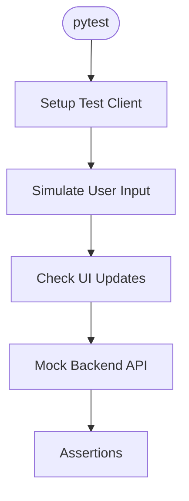

# test_chat_flow.py — Frontend Chat Flow Test

At-a-Glance Summary:
- Pytest test for the main chat flow in NsureCat frontend.
- Verifies user input, chat history, and UI updates.
- Ensures integration between frontend and backend API.



## Public Interface
- Pytest test functions for chat flow.
- Uses test client to simulate frontend interactions.

## Dependencies
- Inbound: Pytest runner
- Outbound: Frontend code, backend API (mocked)

## Edge Cases
- Handles invalid input and error states.
- Tests both normal and edge chat scenarios.

## Example Usage
```bash
pytest tests/frontend/test_chat_flow.py
```

## Change Hooks
- Frontend code changes in `chat.js`, `index.html`
- Backend API changes

## Links
- [Chat Logic Doc](../../../src/frontend/chat.js.md)
- [Frontend README](../../../src/frontend/README.md)
