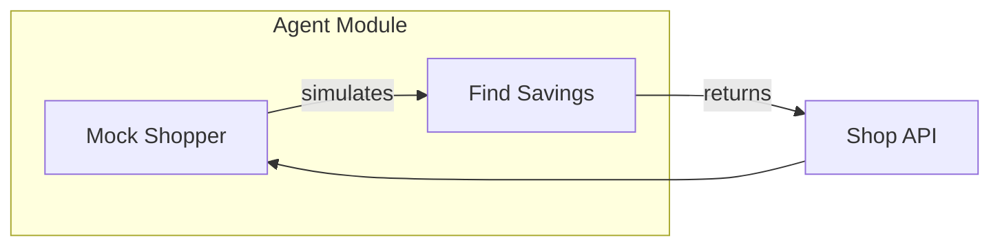

# Agent Module

Provides AI-driven logic for insurance shopping and savings analysis.

## Architecture Diagram

## Contents Index

- **Files:**
  - [mock_shopper.py](../../../docs/agent/mock_shopper.md) - Mock AI agent for insurance quote shopping.

- **Subfolders:** None

## Entry Points

- Called by `api_routes/shop.py` via `find_savings()`.

## Contracts

- Input: Dict of insurance coverage fields.
- Output: Dict with savings amount and new carrier.

## Tests/Verification

- Run `pytest tests/agent/test_mock_shopper.py` to verify mock behavior.
