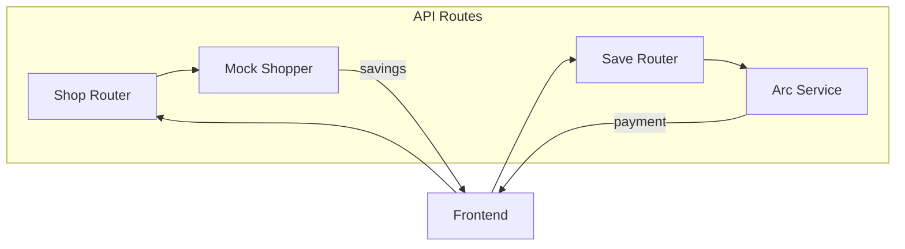

# API Routes Module

FastAPI routers connecting frontend to backend business logic.

## Architecture Diagram

## Contents Index

- **Files:**
  - [save.py](../../../docs/api_routes/save.md) - Router for saving/paying fees.
  - [shop.py](../../../docs/api_routes/shop.md) - Router for shopping insurance quotes.

- **Subfolders:** None

## Entry Points

- Mounted in `backend/main.py` under `/v1/` prefix.

## Contracts

- Shop: POST /shop with coverage fields → savings response.
- Save: POST /save with wallet address → payment status.

## Tests/Verification

- Integration tests in `tests/api_routes/`.
