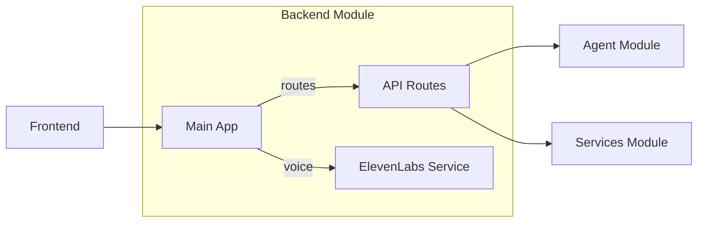

# Backend Module

Core FastAPI application and supporting services for voice and API handling.

## Architecture Diagram

## Contents Index

- **Files:**
  - [elevenlabsVoice.py](../../../docs/backend/elevenlabsVoice.md) - Voice synthesis script.
  - [main.py](../../../docs/backend/main.md) - Main FastAPI app with CORS and endpoints.

- **Subfolders:** None

## Entry Points

- Run `uvicorn backend.main:app --host 0.0.0.0 --port 8000`.

## Contracts

- Text-to-speech: POST /api/text-to-speech → audio stream.
- Voices: GET /api/voices → voice list.

## Tests/Verification

- Unit tests in `tests/backend/test_main.py`.
