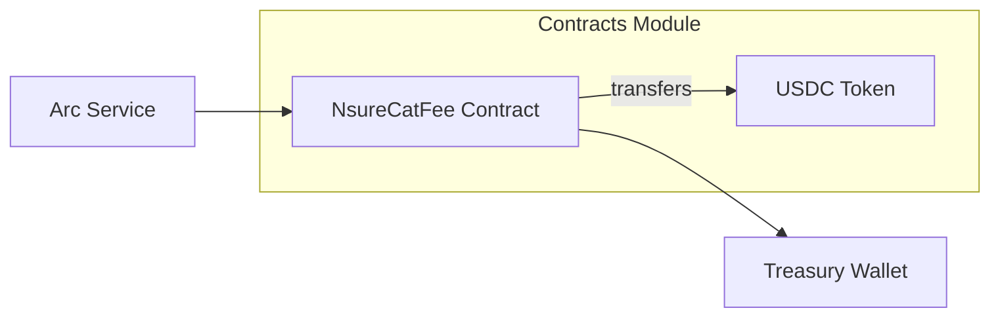

# Contracts Module

Smart contracts for blockchain interactions, specifically fee payments.

## Architecture Diagram

## Contents Index

- **Files:**
  - [NsureCatFee.sol](../../../docs/contracts/NsureCatFee.md) - Solidity contract for fee collection.

- **Subfolders:** None

## Entry Points

- Deployed on Arc Testnet; called via Web3 in `services/arc_service.py`.

## Contracts

- payFee(): Transfers 0.01 USDC from sender to treasury.

## Tests/Verification

- Deploy and test on Arc Testnet; no local tests yet.
