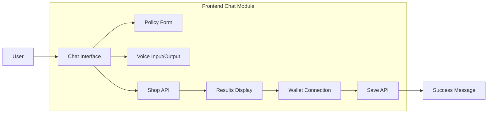

# Frontend Module - Chat Interface

Single-page chat application using vanilla HTML/JS/CSS, served by Python http.server.

## 📚 Documentation

**For complete documentation, see:**
- **[docs/frontend/README.md](../../docs/frontend/README.md)** - Complete documentation index
- **[Quick Start Guide](../../docs/frontend/quick_start.md)** - Get up and running in 5 minutes
- **[Implementation Summary](../../docs/frontend/implementation_summary.md)** - Architecture and features
- **[Integration Verification](../../docs/frontend/integration_verification.md)** - Testing checklist

## Architecture Overview

NsureCat uses a conversational chat interface where users interact with "Cat" (AI assistant) to:

1. Input their current insurance policy details (via form or voice)
2. Get AI-powered savings quotes from multiple carriers
3. Select a better policy option
4. Pay a fee via blockchain (MetaMask/Circle) to unlock savings

## Architecture Diagram



## File Structure

### Main Files:
- **index.html** - Main chat interface page with modals for policy form and wallet
- **chat.js** - Complete chat application logic (600+ lines)
- **styles.css** - Comprehensive styling with dark mode support

### Legacy Files (Deprecated):
- scan.html, scan.js - Old policy input page
- results.html, results.js - Old results page
- checkout.html, checkout.js - Old checkout page
- success.html - Old success page
- voice.html - Old voice page

*Note: Legacy files kept for reference but not used in new chat flow*

## Key Features

### 1. Chat Interface
- Real-time conversational UI with Cat (AI assistant)
- Message bubbles (Cat: left, User: right)
- Quick reply buttons for common actions
- Chat history persistence in localStorage
- Auto-scroll to latest message

### 2. Policy Input
- Modal form with dropdowns for all coverage fields:
  - State, Carrier, Amount (6 months)
  - Bodily Injury, Property Damage
  - Uninsured Motorist, Collision
  - Comprehensive, Personal Injury Protection
- Form validation with required fields
- Embedded in chat flow

### 3. Voice Integration
- **Input**: Web Speech API for voice recognition
- **Output**: ElevenLabs TTS via backend API
- Voice button toggles recording (🎤 / ⏹️)
- TTS buttons on Cat messages (🔊)
- Fallback to text if voice not supported

### 4. Savings Results
- Displays results in chat as styled cards
- Shows carrier name and savings amount
- "Choose This" button to select option
- Animated loading during API calls

### 5. Wallet Connection
- Modal with MetaMask and Circle options
- MetaMask integration via window.ethereum
- Wallet address display (truncated)
- Payment processing with fee calculation (10% of savings)
- Shows net savings (90% of total)

### 6. Theme Support
- Light mode (default) and dark mode
- Toggle button in header (🌙 / ☀️)
- Persisted in localStorage
- CSS variables for easy theming

### 7. Responsive Design
- Mobile-first approach (320px+)
- Tablet breakpoint (768px)
- Desktop optimized (1024px+)
- Touch-friendly buttons
- Adaptive layout

## API Integration

### Backend Endpoints Used:

1. **Shop API**: `POST http://localhost:8000/v1/shop`
   - Request: Policy coverage data (JSON)
   - Response: `{ "savings_6mo": number, "new_carrier": string }`

2. **Save API**: `POST http://localhost:8000/v1/save`
   - Request: `{ "wallet_address": string }`
   - Response: `{ "status": "success" }`

3. **Text-to-Speech**: `POST http://localhost:8000/api/text-to-speech`
   - Request: `{ "text": string, "voice_id": string }`
   - Response: Audio stream (MPEG)

## State Management

Global `appState` object manages:
- `chatHistory`: Array of messages (persisted)
- `userData`: Policy details from form
- `selectedResult`: Chosen savings option
- `walletAddress`: Connected wallet
- `theme`: 'light' or 'dark'
- `isVoiceEnabled`: Voice support flag
- `isProcessing`: Loading state

All state saved to localStorage:
- `nsurecat_chat_history`
- `nsurecat_user_data`
- `nsurecat_theme`

## User Flow

1. **Greeting**: Cat welcomes user, offers Form or Voice input
2. **Data Collection**: User fills policy form or speaks details
3. **Summary**: Cat confirms policy details
4. **Processing**: Cat shows "reaching out to carriers" animation, calls Shop API
5. **Results**: Displays savings card with carrier and amount
6. **Selection**: User clicks "Choose This" button
7. **Wallet**: Modal opens for MetaMask/Circle connection
8. **Payment**: Processes fee (10%), calls Save API
9. **Success**: Shows net savings (90%) and confirmation

## Testing

Tests located in `/tests/frontend/`:
- `test_chat_flow.py` - Pytest tests for chat functionality
- Integration tests with backend APIs
- Voice input/output tests
- Wallet connection tests

## Development

### Running Frontend:
```bash
# From project root
python -m http.server 8001 --directory src/frontend
```

### Accessing:
- Main chat: `http://localhost:8001/index.html`
- Backend API: `http://localhost:8000` (must be running)

### Browser Requirements:
- Modern browser (Chrome, Firefox, Safari)
- JavaScript enabled
- Web Speech API support (for voice features)
- MetaMask extension (for wallet features)

## Error Handling

- **Network errors**: "Network error. Please check your connection and try again."
- **API 500 errors**: "Server error. Please try again later."
- **Validation errors**: Inline form messages
- **Voice errors**: "Voice recognition failed. Please try typing instead."
- **Wallet errors**: "MetaMask not detected. Please install MetaMask."
- **Loading states**: Spinner with disabled buttons
- **Unexpected errors**: "Something went wrong. Please refresh the page."

## Accessibility

- ARIA labels on all interactive elements
- Keyboard navigation support
- Screen reader compatible
- Focus indicators
- Reduced motion support (prefers-reduced-motion)
- data-testid attributes for testing

## Browser Compatibility

- Chrome/Edge 90+
- Firefox 88+
- Safari 14+
- Mobile browsers (iOS Safari, Chrome Mobile)

## Future Enhancements

- [ ] Policy document upload (OCR)
- [ ] Multi-carrier results comparison
- [ ] Circle wallet integration
- [ ] Voice command shortcuts
- [ ] Chat export feature
- [ ] Mobile app (PWA)

