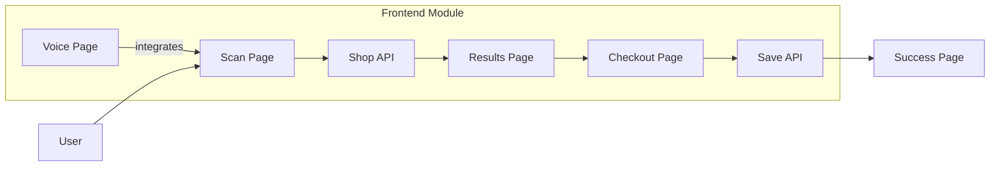

# Frontend Module

Static web interface using vanilla HTML/JS/CSS, served by Python http.server.

## Architecture Diagram

## Contents Index

- **Files:**
  - [checkout.html](../../../docs/frontend/checkout.html.md) - Wallet connection and payment page.
  - [checkout.js](../../../docs/frontend/checkout.js.md) - Checkout logic.
  - [results.html](../../../docs/frontend/results.html.md) - Savings display page.
  - [results.js](../../../docs/frontend/results.js.md) - Results handling.
  - [scan.html](../../../docs/frontend/scan.html.md) - Policy input form.
  - [scan.js](../../../docs/frontend/scan.js.md) - Form submission and voice input.
  - [styles.css](../../../docs/frontend/styles.css.md) - Global styles.
  - [success.html](../../../docs/frontend/success.html.md) - Payment success page.
  - [voice.html](../../../docs/frontend/voice.html.md) - AI voice assistant page.

- **Subfolders:** None

## Entry Points

- Served at `http://localhost:3000/` via `python -m http.server 3000`.

## Contracts

- Fetches from backend at `http://localhost:8000/v1/*`.

## Tests/Verification

- Manual testing in browser; no automated tests.
