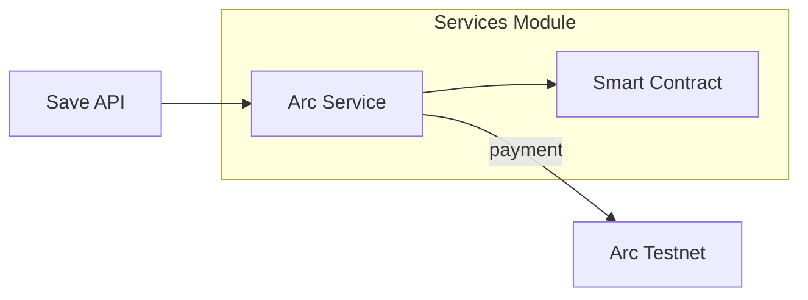

# Services Module

Modules for external API and blockchain integrations.

## Architecture Diagram

## Contents Index

- **Files:**
  - [arc_service.py](../../../docs/services/arc_service.md) - Blockchain fee processing.

- **Subfolders:** None

## Entry Points

- Called by `api_routes/save.py`.

## Contracts

- process_fee(wallet): Returns payment status dict.

## Tests/Verification

- Mocked in tests; verify on testnet.
